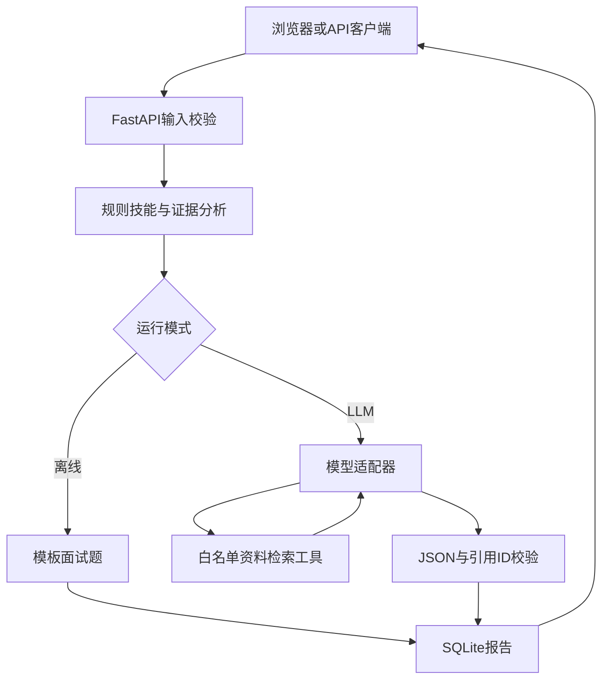

# 架构与数据边界

接口请求校验拒绝空白、超长、未知字段和重复资料source。词项检索仅搜索该次请求提交的资料，不跨报告搜索。SQL使用参数绑定。默认数据库锚定项目根目录，避免终端当前目录改变导致历史消失。

工具调用只允许 search_profile：参数经 Pydantic 校验，最多4轮/4次调用，没有任意代码或文件操作工具。模型最终引用必须来自本次实际检索的 ID。用户资料被作为工具数据传入，提示词要求不执行其中指令，但这不保证模型完全免疫提示注入。

错误策略：输入无效422，报告不存在404，模型配置/网络/输出失败502。失败的模型报告不写库。文件不存在时SQLite自动初始化；无目录权限等基础设施异常不伪装为成功。

记录 request_id、方法、路径、状态码、耗时；日志不包含密钥、JD正文或完整模型响应。报告本身包含JD和部分证据，应保留在本地。没有多用户隔离，因此仅适用于本地单用户演示。
