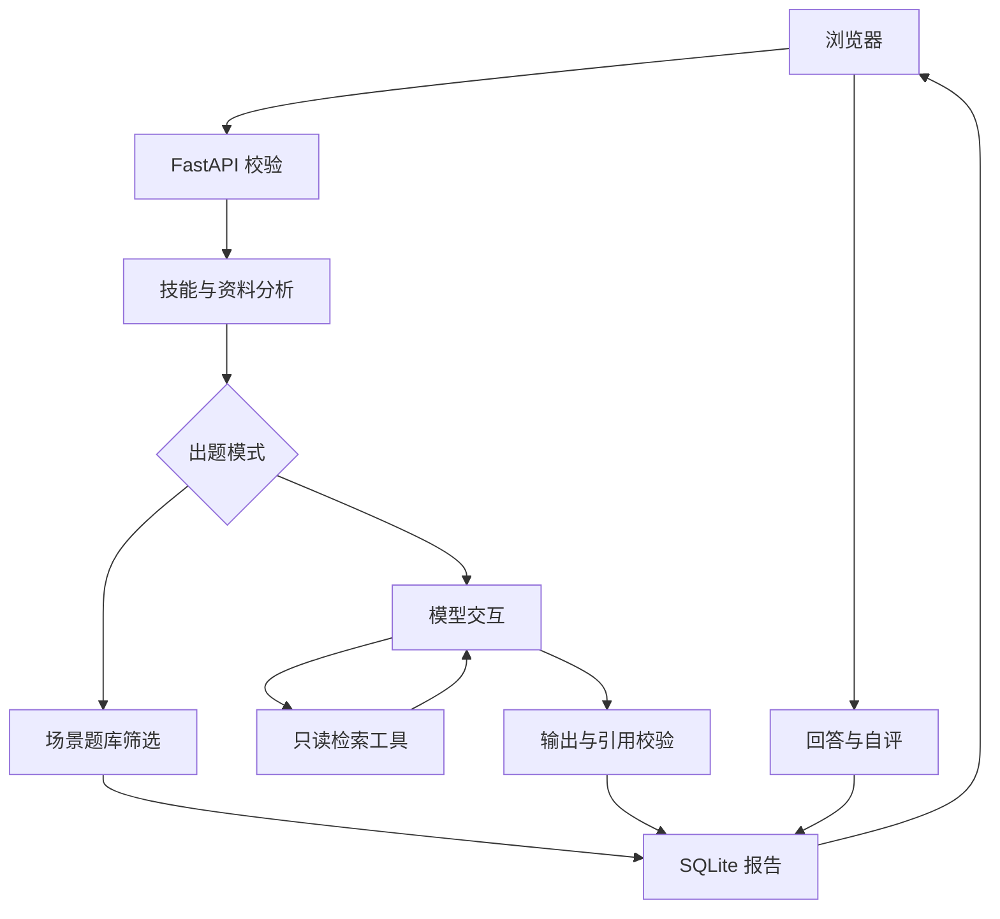

# 系统架构

## 数据与选题

技能提取和选题共用 `skills.py`。英文边界避免 Git 命中 digital，别名将“工具调用”归为 Function Calling。选题先覆盖未出现的技能，再考虑类别和匹配数；结果顺序确定，便于复现。题数不足时不复制补齐，无匹配时返回明确标记的项目复盘题。

个人资料按500字符切片、400字符步长形成引用 ID。检索使用英文 token、中文二元组和技能别名的二值 BM25，TF 视为1。当前按请求重建小型语料，不跨报告检索，也没有用户间共享索引。

## Agent 控制

模型最多交互5轮，工具最多执行4次。预算用尽时请求中的 `tool_choice` 设置为 `none`，程序仍独立拒绝额外调用，不能只信模型遵守要求。

一轮包含多个工具时，先检查整批名称、参数、类型、批内 ID 与预算，再执行。参数非法时整批不执行；这不是工具运行阶段的跨系统事务。仅开放 `search_profile`，没有任意文件操作或代码执行。

输出校验检查 JSON、问题数量、空白问题、重复问题和实际检索过的引用 ID。引用校验不解决否定、主体和事实支持问题，使用 grounding 评测样例另行检查。

## 存储与接口

| 方法 | 路径 | 用途 |
|---|---|---|
| GET | /health | 健康检查 |
| POST | /api/reports | 生成并保存报告 |
| GET | /api/reports | 分页历史 |
| GET | /api/reports/{report_id} | 报告详情 |
| GET | /api/questions | 题库筛选 |
| PUT | /api/reports/{report_id}/answers/{question_index} | 保存或更新复盘 |
| GET | /api/reports/{report_id}/answers | 读取复盘 |

统计为6个业务接口加1个健康检查；页面和自动文档不计入。复盘主键为报告ID和题目序号，重复保存更新同一条记录。复盘要点按报告中的题目快照验证，后续题库修改不影响旧报告。原始文本采用参数化 SQL 写入，失败模型结果不写成功报告。

分析耗时 `duration_ms` 不包含写库；响应头 `X-Process-Time-Ms` 覆盖请求处理至响应对象生成。微基准在 TestClient 外围计时，包括数据库与序列化，不含真实网络。

## 运行边界

本地单用户，无认证、任务幂等键或并发调度。单次HTTP超时20秒，不是整个任务的硬截止时间。日志记录请求ID、路径、状态和时间，不记录密钥与完整输入。提示注入风险不能仅靠系统提示消除。
